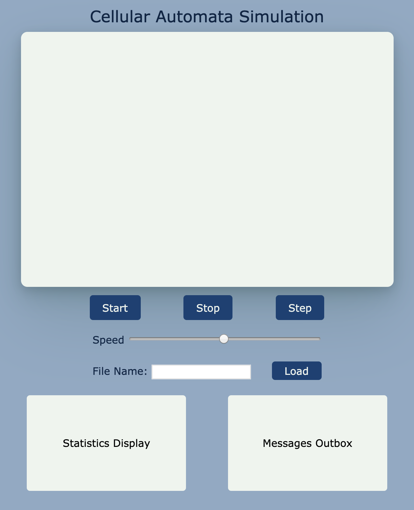

# **Simulation Design Plan**
### **Team Number**: 12 
### **Names**: 
Charles Papandreou (cnp20),
Turner Jordan (tgj5),
Eric Carlson (ecc45)

###- **Introduction**:

This program will implement a closed framework that runs and animates various 2D simulations of Cellular Automata *(CA)*.
Use cases include *The Game of Life*, *Percolation*, *Segregation*, *Predator-Prey*, and *Fire*. 
We aim to design a program that can be extended to support many different CA simulations. This project will be
*open for extension* in that new cell objects can be created to accommodate CA simulations besides those described above, 
through the use of formatted XML documents. However, its *core functionality* -- the UI, the animation, and the simulation
 itself -- will be *closed* for modification. 

###- **Overview**:

**Components**: The important classes are the *simulation* class, *grid* class, and *cell* class. The three are organized 
in a relatively linear manner -- the simulation class draws on the grid class, which draws on the cell class.

The **simulation** will have • a stage, • a scene, • a *grid* object corresponding to the current grid, and • two booleans
corresponding to whether or not the simulation has been run and whether or not a step has been completed. It will have
methods that • start the simulation, • stop the simulation, • go through a step, • render the stats display, and •
render the message box.

The **grid** will contain • a 2D array of cells and • a displayPane corresponding to that 2D array. It will have methods 
that • initialize the grid using the relevant information, • update the 2D array of cells, and • update and display the 
displayPane according to the 2D array of cells.

The **cell** object provides the *core functionality* of the project and is open to extension. Each type of CA simulation 
has a corresponding type of cell -- in our current implementation, these cell types are Subclasses. The abstract cell
class has instance variables for • the current state • the next state, and • the Shape object corresponding to the cell.
The *next state* is necessary so that all of the cells can be updated *at the same time*. It will have methods that •
calculate a cell's new state based on a list of its neighbors, • update  a cell's state based on what its new state has 
been set to, and • update the cell's Shape object according to its state.

**Two Instances of Flexibility**:

The **grid** class can use most implementations of a grid-- the instance variable that contains the matrix itself can be 
any sort of Collection, including • a 2D List and • a HashMap *(which would use %rowlen to index into rows)*.

The **cell** class is an abstract class so that methods such as **calcNewState** can be contingent on the cell type. In 
the case of certain implementations of Percolation, one would need to disregard the cells *beneath* a cell when deciding 
whether to turn an *empty* cell to a *full* cell. This would not be possible without an abstract class, as most CA 
simulations take into account all of a cell's neighbors.

###- **User Interface**
**Main Display:**

To keep the UI simple, all user interaction will be hosted in a single window. About half of the window will be the main simulation display. This display will be where the grid is rendered and animated while the simulation is running. The user inputs will be found under the main display. 

**User Inputs:**

There will be **three buttons**: one to start the simulation, one to stop the simulation, and one to manually step the simulation. Then there will be a **slider** that allows the user to configure the speed of the simulation. Underneath, there is a **text input** for the user to enter a file name that contains the XML configurations for the desired simulation. This is accompanied by a **load button** that runs the initialization methods. 

**Additional Outputs:**

There will be two output boxes at the bottom of the window. The first one displays **statistics** about the simulation, such as how many cells of each state currently exist on the grid. This will be continuously updated as the simulation runs. The second one displays **messages** to the user. It will tell the user when the file has been successfully loaded (and that they can now press start to begin the simulation), when the simulation has completed, and report any errors the simulation encounters (e.g. invalid XML file format, invalid file name, unsupported simulation type).

###- **Design Details**

- **Components**

- **Use Cases**
1. Apply the rules to a middle cell: set next state to dead based on game of life implementation.
    1. First, we will be iterating through our grid data structure in the grid class during the calcNextState() method and come to a middle cell.
    2. We will call this cell's calcNextState() function which will count the number of its neighbors that are alive using its stored references to its neighbors.
    3. based on the findings, it has been determined that this cell's next state should be dead.
    4. nextState value is set to dead
    5. after completing iteration of entire grid in grid class, the update function is called, which will set curr state to next state and next state to null for each cell in grid
    6. after updating all states, display() function is called, which will iterate over cells and change their visual aspects to match up with whatever their current state is.
    
2. Apply the rules to an edge cell: set the next state of a cell to live for a cell on the edge, with some of its neighbors missing.
    1. First, we will be iterating through our grid data structure in the grid class during the calcNextState() method and come to an edge cell.
    2. We will call this cell's calcNextState() function which will count the number of its neighbors that are alive using its stored references to its neighbors. The edge cells will have been initialized with the proper neighbor references set to NULL, so we will not use any NULL neighbors in the calculation.
    3. We determine that the cell's next state should be live
    4. nextState value is set to live

###- **Design Considerations**
We had originally discussed storing references to neighbor cells within each cell object, for easy access when checking for an updated state of that cell. The benefits of storing neighbors in each cell is that we would no longer need to use a grid shaped data structure in the grid class, but could simply just use a list instead and iterate over each cell to check. I am unsure whether this is really all that beneficial, but it does provide some more flexibility in terms of data structure/design choice. We ran into the problem of how to initialize this cell if we do not yet know what its neighbors are.
 
We then considered just passing a list of neighbors for the current cell when iterating over grid during calcNewState to the cell that needs to perform the calculations, but realized that this would require us to continuously determine who neighbors are on each step, and would require unneccessary time and extra passing of data.

We have decided for the time being to simply calculate these neighbors once at the beginning while initializing the cell objects in grid and then pass them to be stored for each cell. This will save a good deal of time and confusion during each step and will allow each cell easy access to its neighbors to perform calculations.

Prior to starting the project, we need to take a moment to consider formatting for XML documents and what information in those documents would best benefit our implementation.

### **Team Responsibilities**

- **Team Member #1 (Eric Carlson)**: User Interface

- **Team Member #2 (Charles Papandreou)**: Simulation and Grid

- **Team Member #3 (Turner Jordan)**: Cell class and subclasses

*(Teammates will help as needed, according to how much work each task takes and how difficult a time 
team members are having with these tasks.)*
